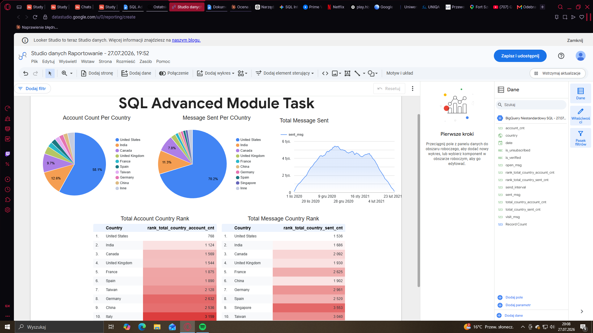

# Email-Campaign-Analysis-SQL-Advanced
SQL analysis of email campaign performance using CTEs, Window Functions and BigQuery
# 📧 Email Campaign Analysis – SQL Advanced

## Business Problem
Analysis of email campaign performance for a global subscription-based business.
The goal was to build a dataset tracking account creation and user activity
(sent, opened, and clicked emails) across key dimensions: country, send interval,
verification status, and subscription status.

The analysis enables comparison of user behaviour between countries,
identification of key markets, and segmentation of users by various parameters.

## Dataset
- Platform: Google BigQuery
- Tables used:
  - `account` — subscriber data (send interval, verification, subscription status)
  - `account_session` — mapping between accounts and sessions
  - `session` — session dates
  - `session_params` — session country
  - `email_sent` — sent messages
  - `email_open` — opened messages
  - `email_visit` — link clicks in emails

## Metrics Calculated
| Metric | Description |
|--------|-------------|
| `account_cnt` | Number of accounts created |
| `sent_msg` | Number of emails sent |
| `open_msg` | Number of emails opened |
| `visit_msg` | Number of link clicks in emails |
| `total_country_account_cnt` | Total accounts per country |
| `total_country_sent_cnt` | Total sent emails per country |
| `rank_total_country_account_cnt` | Country ranking by account count |
| `rank_total_country_sent_cnt` | Country ranking by sent email volume |

Final output includes only countries where either ranking is **≤ 10**.

## SQL Techniques Used
- **5 chained CTEs** — separating logical parts of the query clearly
- **ROW_NUMBER()** — assigning each account exactly one (first) session to avoid row duplication across multiple sessions
- **DENSE_RANK()** — ranking countries by account count and email volume
- **UNION ALL** — combining account and email metrics while preserving their separate date logic
- **LEFT JOIN / INNER JOIN** — across 5 tables
- **COUNT(DISTINCT)** — accurate counting of unique accounts and messages
- **DATE_ADD** — calculating send dates as offsets from first session date
- **CASE WHEN** — transforming binary flags (0/1) into readable labels

## Key Logic
Account and email metrics are calculated **separately** to preserve their unique
date dimensions, then combined via `UNION ALL` and aggregated in a single CTE.
Each account is assigned exactly **one session** (the earliest one) using
`ROW_NUMBER() OVER (PARTITION BY account_id ORDER BY date)`,
preventing row multiplication in joins.

## Visualization
Dashboard built in **Looker Studio** based on the query output,
showing account count, sent emails, and country rankings:

